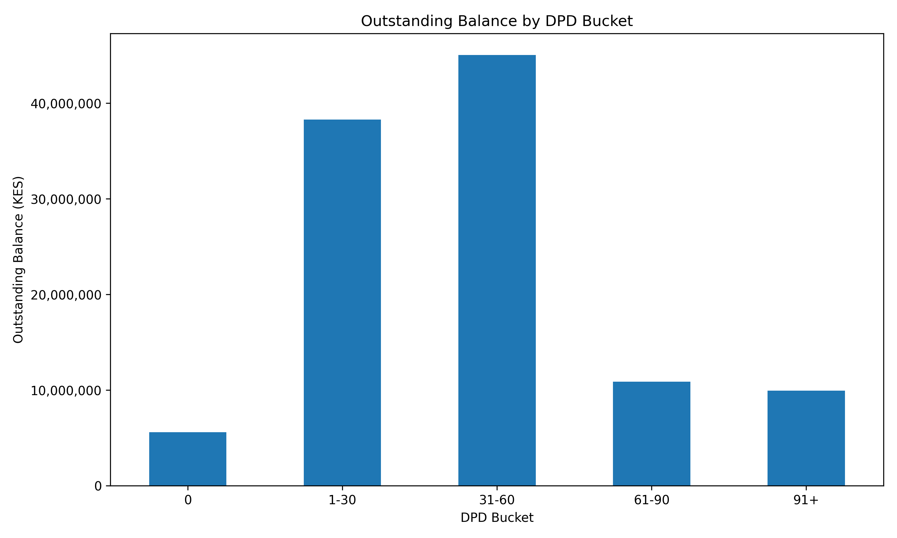
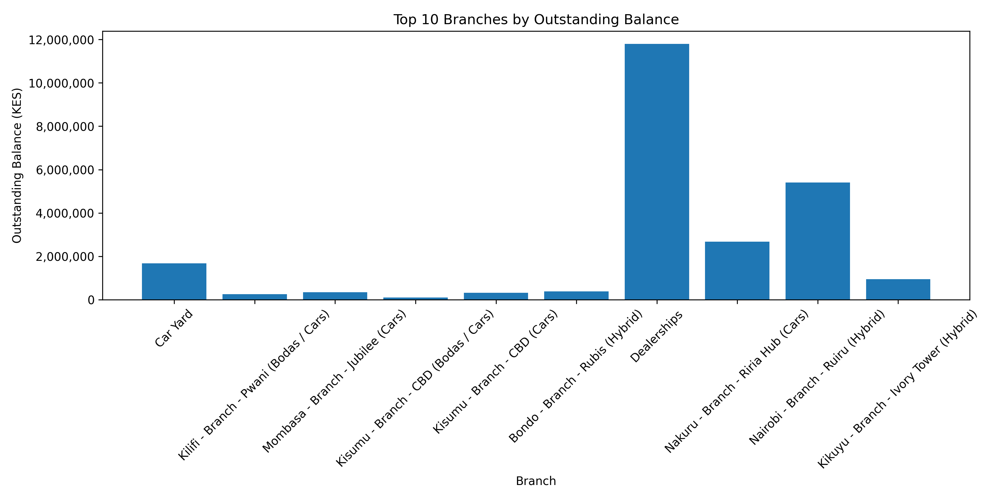
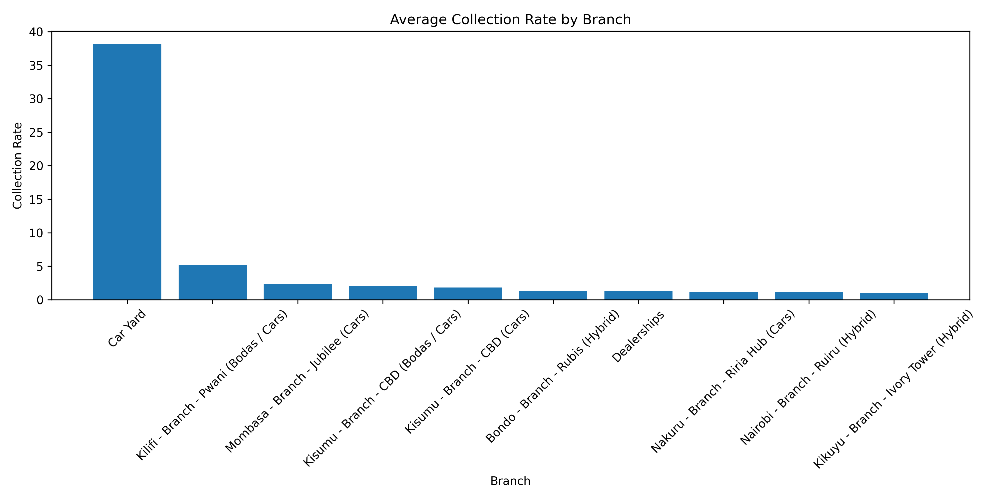
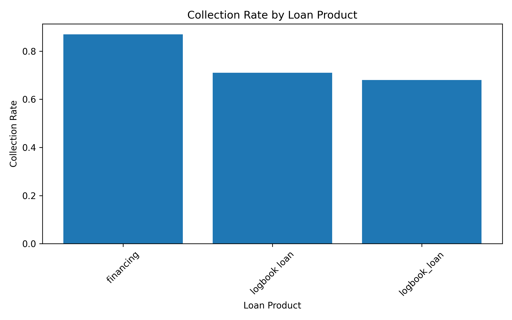
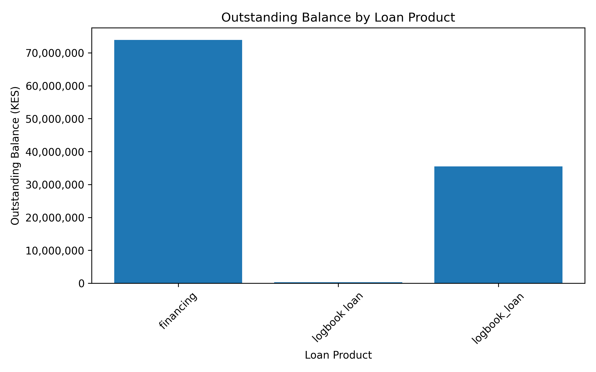
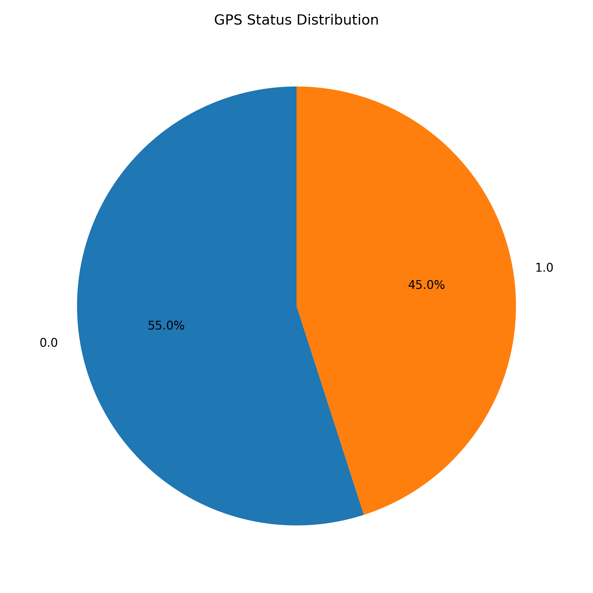
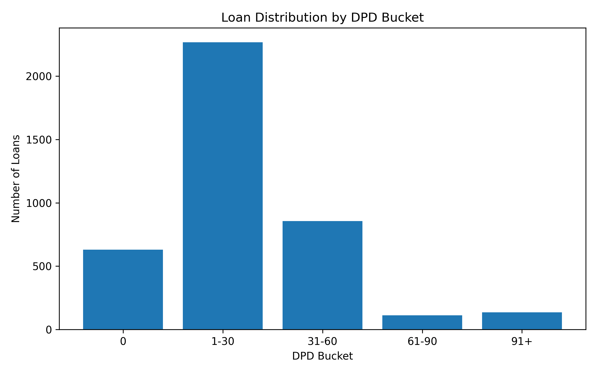
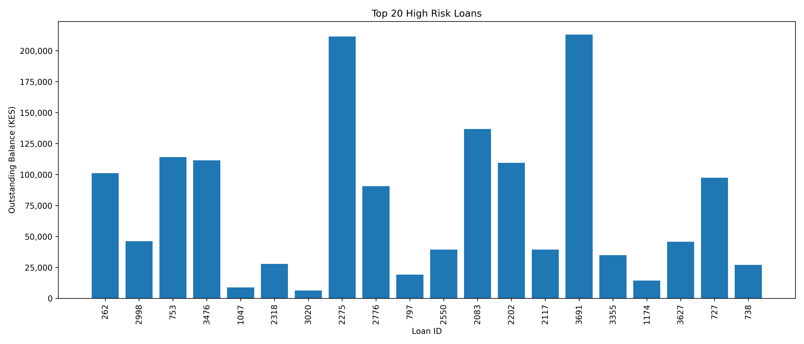

# Loan Portfolio Analysis Using Python

## Overview

This project automates loan portfolio analysis using Python by importing data from multiple Excel worksheets, cleaning and preparing the data, calculating collection KPIs, generating portfolio reports, identifying high-risk loans, visualizing results, and exporting reports to Excel.

---

## Technologies Used

- Python
- Pandas
- NumPy
- Matplotlib
- OpenPyXL
- Google Colab

---

## Project Workflow

- Import loan portfolio data
- Clean and merge datasets
- Calculate collection metrics
- Categorize loans by DPD buckets
- Analyze branch performance
- Analyze loan products
- Identify high-risk loans
- Generate visualizations
- Export reports to Excel

---

# Portfolio Overview

Shows the outstanding loan balance across different Days Past Due (DPD) categories.

---

# Branch Outstanding Balance

Displays the outstanding balance for the top-performing branches.

---

# Average Collection Rate by Branch

Compares collection performance across branches.

---

# Collection Rate by Loan Product

Illustrates how different loan products perform in terms of collections.

---

# Outstanding Balance by Loan Product

Compares outstanding balances across loan products.

---

# GPS Status Distribution

Shows the percentage of loans by GPS status.

---

# Loan Distribution by DPD Bucket

Displays the distribution of loans based on delinquency buckets.

---

# Top 20 High-Risk Loans

Highlights loans with the highest risk based on DPD and outstanding balance.

---

# Project Files

| File | Description |
|------|-------------|
| Automated_Loan_Analysis.ipynb | Python notebook containing the full analysis |
| Automated_Loan_Report.xlsx | Excel report generated by the analysis |
| README.md | Project documentation |

---

# Business Value

This project automates repetitive loan portfolio reporting by reducing manual effort, improving reporting accuracy, and providing actionable insights into portfolio health, branch performance, loan products, and high-risk accounts.

---

# Future Improvements

- Interactive dashboards using Plotly
- SQL database integration
- Power BI dashboards
- Automated email reporting
- Machine learning model for default prediction

---

## 👤 Author

**Edward Momanyi**

Data Scientist | Business Analyst | Data and Risk Analyst | Quality Assurance Expert
